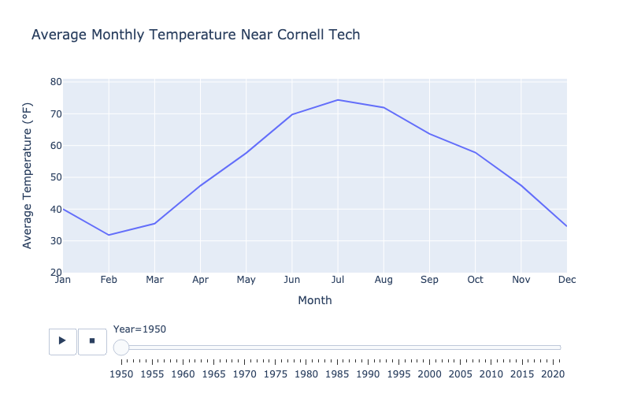
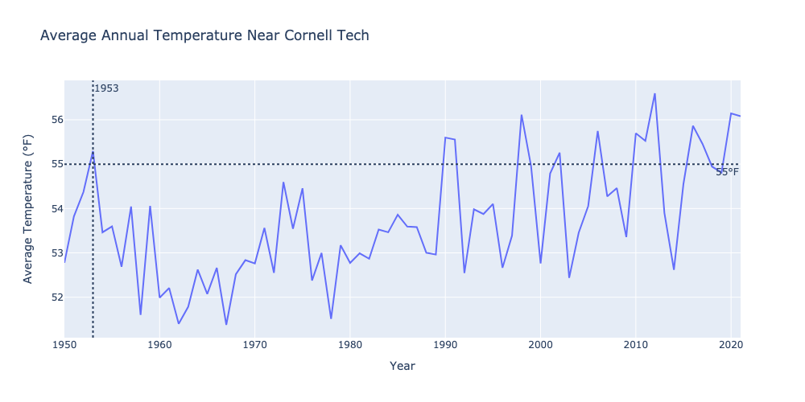
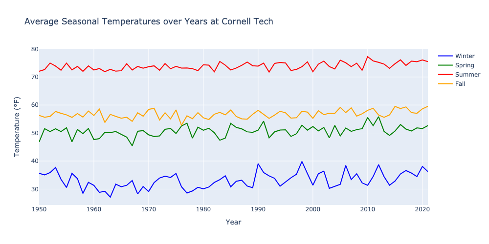

# Question 4: Data Visualization

```python
import pandas as pd
import plotly.express as px
import plotly.graph_objs as go
from plotly.subplots import make_subplots

# Read the data
weather_df = pd.read_csv('data/weather.csv')

# Convert time to datetime
weather_df["time"] = pd.to_datetime(weather_df["time"])

# Calculate Fahrenheit temperature
weather_df["Ftemp"] = (weather_df["Ktemp"] - 273.15) * 9/5 + 32
```

## Part A

```python
# Group by month and year, then calculate the average temperature for each month
weather_df['month'] = weather_df['time'].dt.month
weather_df['year'] = weather_df['time'].dt.year
monthly_avg_temp = weather_df.groupby(['year', 'month'])['Ftemp'].mean().reset_index()
```

```python
# Plotting with an interactive slider for the year
fig = px.line(
    monthly_avg_temp,
    x="month",
    y="Ftemp",
    labels={"Ftemp": "Average Temperature (°F)", "month": "Month", "year": "Year"},
    title="Average Monthly Temperature Near Cornell Tech",
    animation_frame="year",
)

# Update the x-axis to show month names
fig.update_xaxes(
    tickvals=list(range(1, 13)),
    ticktext=[
        "Jan",
        "Feb",
        "Mar",
        "Apr",
        "May",
        "Jun",
        "Jul",
        "Aug",
        "Sep",
        "Oct",
        "Nov",
        "Dec",
    ],
)

# Update the scale of the y-axis
fig.update_yaxes(range=[20, 81])

fig.update_layout(width=800, height=500)

fig.write_image("plots/partA.png")
fig.write_html("plots/partA.html")
fig.show()
```



To view the interactive plot, please visit the following link: [yufanbruce.com/dsw/posts/a2](https://yufanbruce.com/dsw/posts/a2/#Question4).

## Part B

```python
# Group by year to calculate average annual temperature
annual_avg_temp = weather_df.groupby("year")["Ftemp"].mean().reset_index()

# Find the first year where the average temperature exceeds 55 degrees Fahrenheit
first_year_over_55 = int(annual_avg_temp[annual_avg_temp["Ftemp"] > 55].iloc[0]["year"])

print(first_year_over_55)
```

Printing result: `1953`

```python
# Plot the annual average temperature
fig = px.line(
    annual_avg_temp,
    x="year",
    y="Ftemp",
    labels={"Ftemp": "Average Temperature (°F)", "year": "Year"},
    title="Average Annual Temperature Near Cornell Tech",
)

fig.add_hline(
    y=55, line_dash="dot", annotation_text="55°F", annotation_position="bottom right"
)

fig.add_vline(
    x=first_year_over_55,
    line_dash="dot",
    annotation_text=f"{first_year_over_55}",
    annotation_position="top right",
)

fig.update_layout(width=1000, height=500)
fig.write_image("plots/partB.png")
fig.write_html("plots/partB.html")
fig.show()
```



To view the interactive plot, please visit the following link: [yufanbruce.com/dsw/posts/a2](https://yufanbruce.com/dsw/posts/a2/#Question4).

### When is the first year where the year's average temperature passes 55 degrees

- Answer: 1953

## Part C

```python
# Defining seasons based on months for simplicity
def season(month):
    if month in [12, 1, 2]:
        return 'Winter'
    elif month in [3, 4, 5]:
        return 'Spring'
    elif month in [6, 7, 8]:
        return 'Summer'
    else:
        return 'Fall'

# Assign the season to each row
weather_df['Season'] = weather_df['time'].dt.month.apply(season)

# Group by year and season to get the average temperature for each season of each year
seasonal_avg = weather_df.groupby([weather_df['time'].dt.year, 'Season'])['Ftemp'].mean().unstack()
```

```python
fig = make_subplots(
    rows=1, cols=1
)

colors = {"Winter": "blue", "Spring": "green", "Summer": "red", "Fall": "orange"}

for season, color in colors.items():
    fig.add_trace(
        go.Scatter(
            x=seasonal_avg.index,
            y=seasonal_avg[season],
            mode="lines",
            name=season,
            line=dict(color=color),
        ),
        row=1,
        col=1,
    )

fig.update_layout(
    title_text="Average Seasonal Temperatures over Years at Cornell Tech",
    xaxis_title="Year",
    yaxis_title="Temperature (°F)",
)

fig.update_layout(width=1000, height=500)

fig.write_image("plots/partC.png")
fig.write_html("plots/partC.html")
fig.show()
```



To view the interactive plot, please visit the following link: [yufanbruce.com/dsw/posts/a2](https://yufanbruce.com/dsw/posts/a2).

### Write-up:

The visualization presents four line charts, each corresponding to a different season (Winter, Spring, Summer, and Fall), showing the average temperatures over the years from 1950 to the present near Cornell Tech. Each seasonal line chart progresses in a relatively parallel fashion, suggesting that while there may be some warming or cooling trends, the seasonal temperature patterns maintain a consistent relationship to each other over the decades.
